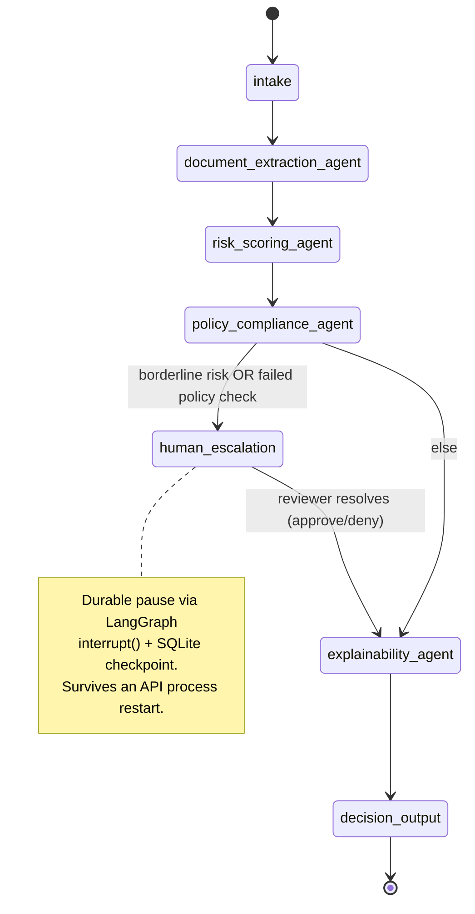
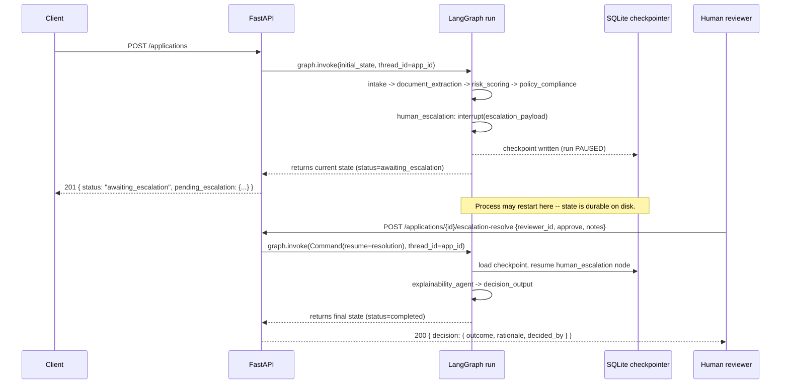

# Credit Underwriting Decision Graph: A LangGraph Multi-Agent System for Explainable Loan Adjudication

> **Fictional bank disclaimer:** In this repo, **"Northbridge Financial Group"** — is a
> wholly invented company name, created solely for this project. All
> applicants, loan applications, pay-stub text, and credit data are
> **synthetic**. No real institution, dataset, or individual is represented
> anywhere in this repo.

## Why this exists

Enterprise lending decisions increasingly involve LLM-based agents, but a
bank cannot ship a system where "the model decided" is the whole audit
trail — it needs to survive fair-lending review, explain every adverse
decision in plain language, and keep working when a dependency degrades
mid-run. This project is a concrete, runnable example of that pattern: a
multi-agent LangGraph pipeline where deterministic, testable code makes
every approve/deny decision, an LLM only *explains* it, a human reviewer is
durably in the loop for borderline cases, and every agent action is traced
and audited.

## Architecture



Seven nodes, matching `src/underwriting/service/graph.py` and
`service/nodes.py` exactly:

| Node | Role |
|---|---|
| `intake` | Validates/normalizes the inbound synthetic application payload. |
| `document_extraction_agent` | Parses synthetic pay-stub/financial-statement TEXT into structured fields via a simulated LLM call. |
| `risk_scoring_agent` | Computes debt-to-income ratio + credit-band risk tier, calling a mock "credit bureau" tool. |
| `policy_compliance_agent` | Runs a synthetic, illustrative lending-policy ruleset; flags fair-lending-adjacent consistency concerns. |
| `human_escalation` | **Durably pauses** the graph run for borderline/blocked cases via LangGraph's `interrupt()`; resumes from a reviewer's decision. |
| `explainability_agent` | Renders the (already-decided) outcome as a plain-English rationale naming the driving factors, via the pluggable chat model. |
| `decision_output` | Finalizes the decision and emits the terminal audit event. |

### Human-escalation sequence



## Key Design Decisions

1. **The LLM never decides approve/deny.** `domain/decisioning.py` is a
   pure, deterministic function of risk tier + policy flags (+ a human
   reviewer's decision, if escalated). The chat model's only job is to
   render an already-fixed outcome as prose. This means an LLM hallucination
   can produce an awkward rationale, never a wrong decision — and it makes
   the core business logic unit-testable with zero mocking.
2. **`MockChatModel` is a real `BaseChatModel`, not a stub.** It implements
   LangChain's chat-model `Runnable` contract and does deterministic,
   rule-based extraction/rationale generation keyed off structured prompt
   content (see `infrastructure/llm.py`). That's what lets `pytest` assert
   on *exact* rationale content (e.g. "the denial rationale must mention the
   DTI figure") without a network call, while remaining a drop-in swap for
   `ChatOpenAI`/`ChatAnthropic`.
3. **SQLite checkpointing, single replica, by design — with the scaling
   path documented rather than silently broken.** LangGraph's `interrupt()`
   needs a durable checkpointer to survive a process restart between
   escalation and resolution. SQLite is the simplest correct choice for a
   single-process demo; `deploy/k8s/deployment.yaml` pins `replicas: 1` and
   documents (rather than hides) that horizontal scaling requires swapping
   in a Postgres-backed LangGraph checkpointer shared across pods.
4. **State is plain JSON-serializable dicts, not live Pydantic objects.**
   `service/state.py`'s `UnderwritingState` TypedDict stores
   `model_dump(mode="json")` output, not model instances. This removes any
   ambiguity about how the checkpointer's serializer round-trips custom
   classes, and makes `GET /applications/{id}` a direct passthrough of graph
   state with no custom encoder.
5. **Escalation is `risk_tier == BORDERLINE` OR a BLOCKing policy flag.**
   A clean risk score with an unreliable document extraction (low
   confidence) or an over-leveraged request still routes to a human — the
   system escalates whenever it *cannot responsibly decide*, not only when
   the risk math lands in the middle band.

## Governance & Guardrails

See **[GOVERNANCE.md](GOVERNANCE.md)** for the full write-up. Highlights:

- **Explainability & adverse-action rationale**: every decision — approved
  or denied — gets a plain-English rationale (`GET
  /applications/{id}/rationale`); denials additionally carry
  `adverse_action_reasons`, a list of specific factor-level reasons, mirroring
  the real-world practice of giving applicants concrete reasons for an
  adverse credit decision.
- **Permitted-factor allow-listing**: `domain/policy.py::PERMITTED_FACTORS`
  is the only set of factors the rationale is allowed to cite; protected-
  class-adjacent factors (age, race, gender, zip code, marital status,
  national origin) are never even collected by `LoanApplication`.
- **Human-in-the-loop**: borderline/blocked cases durably pause for a named
  reviewer's explicit approve/deny, which becomes authoritative.
- **Audit logging**: every agent/tool action emits a structured, PII-redacted
  audit event (`infrastructure/audit_log.py`), retrievable per-application.
- **PII redaction** (`infrastructure/pii_redaction.py`) and **prompt-injection
  sanitization** (`infrastructure/prompt_guard.py`) are applied before any
  data reaches a log line or an LLM prompt, respectively.

This project does not implement, and makes no claim of compliance with, any
specific named financial regulation. It demonstrates *patterns* (allow-listed
factors, durable human escalation, adverse-action rationale, audit trails)
that are relevant to that space, for engineering-portfolio purposes.

## Getting Started

Requires Python 3.10–3.12. No API keys, no external services, no Docker
required for local dev.

```bash
git clone <this-repo-url>
cd langgraph-multiagent-underwriting

make install        # creates .venv/ and installs the package + dev deps
make test            # runs the full pytest suite (fully offline)

python scripts/demo.py     # runs all 3 decision paths end-to-end, prints results

make run             # starts the API at http://localhost:8000 (docs at /docs)
```

### Try the API by hand

```bash
# 1. Submit a low-risk application (straight-through approval)
curl -s -X POST http://localhost:8000/applications \
  -H "Content-Type: application/json" \
  -d '{
        "applicant_full_name": "Alex B. Approved",
        "requested_amount": 15000,
        "loan_purpose": "auto",
        "employment_status": "employed_full_time",
        "stated_annual_income": 62400,
        "stated_monthly_debt": 400,
        "raw_financial_document_text": "NORTHBRIDGE FINANCIAL GROUP - SYNTHETIC PAY STATEMENT (DEMO DATA ONLY)\nEMPLOYER: Riverstone Logistics LLC\nPAY_FREQUENCY: biweekly\nGROSS_PAY_PER_PERIOD: $2400.00\nNET_PAY_PER_PERIOD: $1850.00\nEXISTING_MONTHLY_DEBT: $400.00\n"
      }' | python -m json.tool

# 2. Fetch full state/history for an application
curl -s http://localhost:8000/applications/<application_id> | python -m json.tool

# 3. Resolve a paused (borderline) escalation as a reviewer
curl -s -X POST http://localhost:8000/applications/<application_id>/escalation-resolve \
  -H "Content-Type: application/json" \
  -d '{"reviewer_id": "jdoe123", "approve": true, "notes": "Verified manually."}'

# 4. Get just the rationale
curl -s http://localhost:8000/applications/<application_id>/rationale
```

### Using a real LLM provider (optional)

```bash
pip install -e ".[providers]"
export OPENAI_API_KEY=sk-...     # or ANTHROPIC_API_KEY
make run
```

With no key set, `infrastructure/llm.py::get_chat_model` returns the
offline `MockChatModel`; with a key set, it returns a resilience-wrapped
`ChatOpenAI`/`ChatAnthropic`. Every node is written against the
`Runnable` interface, so nothing else changes.

## Production Deployment

- **Docker**: `Dockerfile` is a multi-stage, non-root, pinned-base-image
  build. `docker compose up --build` runs the full stack locally with a
  persisted checkpoint volume.
- **Kubernetes**: `deploy/k8s/` ships `Deployment`, `Service`, `ConfigMap`,
  a `Secret` *template* (`secret.yaml.example` — never commit filled-in
  secrets), a `PersistentVolumeClaim` for the checkpoint DB, and a
  `HorizontalPodAutoscaler` (with its single-replica-until-Postgres caveat
  documented inline).
- **OpenShift**: see `deploy/OPENSHIFT.md` for SCC vs. Pod `securityContext`
  differences, `DeploymentConfig` vs. `Deployment`, and `Route` vs.
  `Ingress` notes.
- **CI**: `.github/workflows/ci.yml` runs ruff, mypy, pytest (matrixed
  across Python 3.10–3.12), and a Docker build on every push/PR — entirely
  offline, no secrets referenced.

## Observability

Every node wraps its execution in a lightweight tracing span
(`infrastructure/tracing.py`) with a name, id, start/end time, duration,
and attributes — the same shape as an OpenTelemetry span, deliberately kept
dependency-free for this demo. Spans accumulate in `trace_spans` and are
retrievable via `GET /applications/{id}`.

**In production**, this module's `start_span` context manager would be a
near-mechanical swap for the real `opentelemetry-sdk`: wrap the same call
sites with `tracer.start_as_current_span(...)`, configure an OTLP exporter,
and point it at a collector feeding Prometheus (metrics: request latency,
node duration histograms, escalation rate, circuit-breaker trips) and
Grafana/Datadog (dashboards + alerting on the same). Structured JSON logs
(`infrastructure/logging_config.py`) already carry a per-request
correlation id, so traces, metrics, and logs would correlate cleanly
through a standard log-metrics-traces pipeline.

## Tech Stack

| Layer | Technology |
|---|---|
| Agent orchestration | LangGraph (`StateGraph`, `interrupt()`, `SqliteSaver` checkpointer) |
| LLM interface | `langchain-core` `Runnable`/`BaseChatModel`; offline `MockChatModel` by default, `ChatOpenAI`/`ChatAnthropic` opt-in |
| API | FastAPI + Uvicorn |
| Validation / config | Pydantic v2, `pydantic-settings` |
| Resilience | `tenacity` (retry + exponential backoff/jitter), hand-rolled circuit breaker |
| Persistence | SQLite (via `langgraph-checkpoint-sqlite`) |
| Testing | `pytest`, `pytest-asyncio`, FastAPI `TestClient` |
| Lint / types | `ruff`, `mypy` |
| Containers | Docker (multi-stage), `docker-compose` |
| Orchestration | Kubernetes manifests, OpenShift notes |
| CI | GitHub Actions |

## Repository Structure

```
langgraph-multiagent-underwriting/
├── src/underwriting/
│   ├── api/                    # FastAPI app: routes, request/response schemas
│   │   ├── main.py
│   │   └── schemas.py
│   ├── domain/                 # Framework-agnostic models + business rules
│   │   ├── models.py           # LoanApplication, RiskAssessment, Decision, ...
│   │   ├── policy.py           # Synthetic lending policy ruleset
│   │   ├── risk.py             # DTI + risk-tier classification math
│   │   ├── decisioning.py      # Deterministic approve/deny outcome logic
│   │   └── errors.py
│   ├── service/                # LangGraph graph + orchestration
│   │   ├── graph.py            # StateGraph assembly (nodes + edges)
│   │   ├── nodes.py            # The 7 agent/utility node implementations
│   │   ├── state.py            # UnderwritingState TypedDict
│   │   └── application_service.py  # Start/get/resolve/rationale orchestration
│   ├── infrastructure/         # External-world adapters
│   │   ├── llm.py              # MockChatModel + provider factory
│   │   ├── credit_bureau.py    # Mock credit bureau tool
│   │   ├── checkpointer.py     # SQLite checkpointer lifecycle
│   │   ├── resilience.py       # Retry + circuit breaker primitives
│   │   ├── audit_log.py        # Structured audit event emission
│   │   ├── pii_redaction.py    # PII scrubbing for logs/audit
│   │   ├── prompt_guard.py     # Prompt-injection sanitization
│   │   ├── tracing.py          # Lightweight OTel-style spans
│   │   └── logging_config.py   # JSON structured logging + correlation ids
│   └── config.py               # pydantic-settings Settings
├── tests/                       # Unit + integration tests (see below)
├── scripts/demo.py              # Offline end-to-end demo script
├── deploy/
│   ├── k8s/                    # Deployment, Service, ConfigMap, Secret template, HPA, PVC
│   └── OPENSHIFT.md
├── .github/workflows/ci.yml     # lint -> typecheck -> test -> docker build
├── Dockerfile
├── docker-compose.yml
├── Makefile
├── GOVERNANCE.md
├── SECURITY.md
└── CONTRIBUTING.md
```

## Testing

```bash
make test          # pytest -v
make lint          # ruff
make typecheck     # mypy
```

63 tests, all offline: `domain/` unit tests (policy, risk, decisioning, no
I/O), `infrastructure/` unit tests (resilience, PII redaction, prompt
guard, credit bureau determinism, mock LLM), graph-level integration tests
(approval / denial / escalation-pause-and-resume against a real compiled
LangGraph graph + SQLite checkpointer), and HTTP-level integration tests
against the full FastAPI app via `TestClient`.

## Roadmap / What I'd Build Next

- **Postgres-backed checkpointer** for multi-replica horizontal scaling
  (swap `SqliteSaver` for LangGraph's Postgres checkpointer; update
  `deploy/k8s/deployment.yaml` to `replicas: N` once done).
- **Real OpenTelemetry SDK wiring** (OTLP exporter -> collector ->
  Prometheus/Grafana), replacing the dependency-free span shim.
- **A second orchestration backend** (e.g. a CrewAI or AutoGen variant of
  the same agents) behind the same `ApplicationService` interface, to
  demonstrate framework-portability of the domain/infrastructure layers.
- **MCP tool exposure**: expose `document_extraction_agent` and
  `risk_scoring_agent` as MCP tools so an external agent host (e.g. Claude,
  an internal chat assistant) could invoke this pipeline directly.
- **Adverse-action letter templating**: turn `Decision.rationale` +
  `adverse_action_reasons` into a formatted, versioned letter template
  suitable for a downstream document-generation service.
- **Load/soak testing** of the escalation pause/resume path at scale, to
  validate checkpoint-store behavior under concurrent paused runs.


---


### Thank you for reading

#### Please consider giving a star if you find the repo useful. Thank you.

---

### **AUTHOR'S BACKGROUND**
### Author's Name:  Emmanuel Oyekanlu
```
Skillset:   I have experience spanning several years in data science, enterprise AI architecture and solutions, developing scalable enterprise data pipelines,
enterprise solution architecture, architecting enterprise systems data and AI applications,
software and AI solution design and deployments, data engineering, industrial intelligent vision systems, high performance computing (GPU, CUDA), machine learning,
NLP, Agentic-AI and LLM applications as well as deploying scalable solutions (apps) on-prem and in the cloud.

I can be reached through: manuelbomi@yahoo.com

Publications:  https://scholar.google.com/citations?user=S-jTMfkAAAAJ&hl=en
LinkedIn:  https://www.linkedin.com/in/emmanuel-oyekanlu-6ba98616
Github:  https://github.com/manuelbomi

```
[](https://skillicons.dev)


